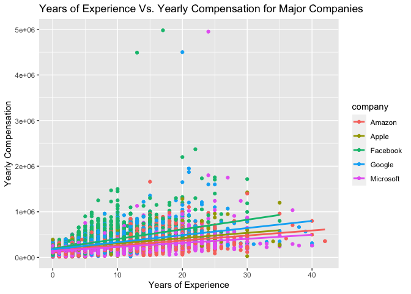
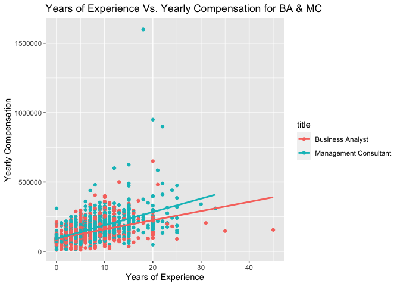

How Data Scientists Salaries Depend on Experience, Job Titles, and
Companies of Employment
================


## Data Wrangling & Brief Summary

The original dataset comes from
[kaggle](https://www.kaggle.com/jackogozaly/data-science-and-stem-salaries).

``` r
df1 <- df %>% # data wrangling 
  select(title, yearsofexperience, totalyearlycompensation) %>%
  filter( title == "Business Analyst" | title == "Management Consultant")
df2 <- df %>% # data wrangling 
  select(title, yearsofexperience, totalyearlycompensation, company) %>%
  filter( company == "Amazon" | company == "Google" | company == "Microsoft" | company == "Apple" | company == "Facebook")

summary(df1)
```

    ##     title           yearsofexperience totalyearlycompensation
    ##  Length:1861        Min.   : 0.000    Min.   :  10000        
    ##  Class :character   1st Qu.: 2.000    1st Qu.:  93000        
    ##  Mode  :character   Median : 5.000    Median : 130000        
    ##                     Mean   : 6.529    Mean   : 147070        
    ##                     3rd Qu.: 9.000    3rd Qu.: 185000        
    ##                     Max.   :45.000    Max.   :1600000

``` r
summary(df2)
```

    ##     title           yearsofexperience totalyearlycompensation
    ##  Length:22690       Min.   : 0.0      Min.   :  10000        
    ##  Class :character   1st Qu.: 3.0      1st Qu.: 170000        
    ##  Mode  :character   Median : 6.0      Median : 220000        
    ##                     Mean   : 7.3      Mean   : 253655        
    ##                     3rd Qu.:10.0      3rd Qu.: 300000        
    ##                     Max.   :42.0      Max.   :4980000        
    ##    company         
    ##  Length:22690      
    ##  Class :character  
    ##  Mode  :character  
    ##                    
    ##                    
    ## 

## Visualizing Relationships

-   Note the relationship between years of experience and salaries is
    expressed in both following visualizations.

### For major companies, such as *Amazon, Apple, Facebook, Google, and Microsoft*:

<!-- -->

### For specific job titles, such as *Business Analyst & Management Consultant*:

``` r
ggplot( df1, aes( x =yearsofexperience, y = totalyearlycompensation, color = title)) + 
  geom_point() + 
  geom_smooth( method = lm, formula = y~x, se = FALSE) + 
  labs( x = "Years of Experience", y = "Yearly Compensation", title = "Years of Experience Vs. Yearly Compensation for BA & MC")
```

<!-- -->
